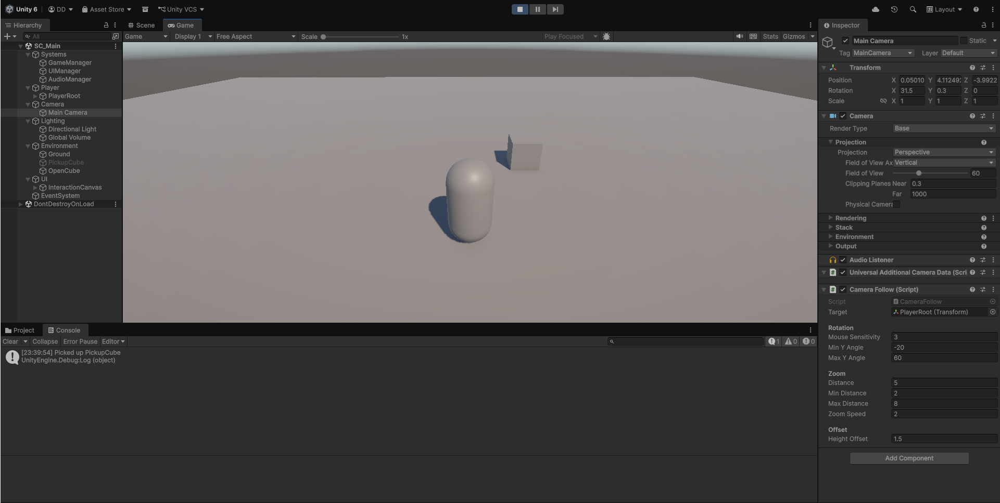
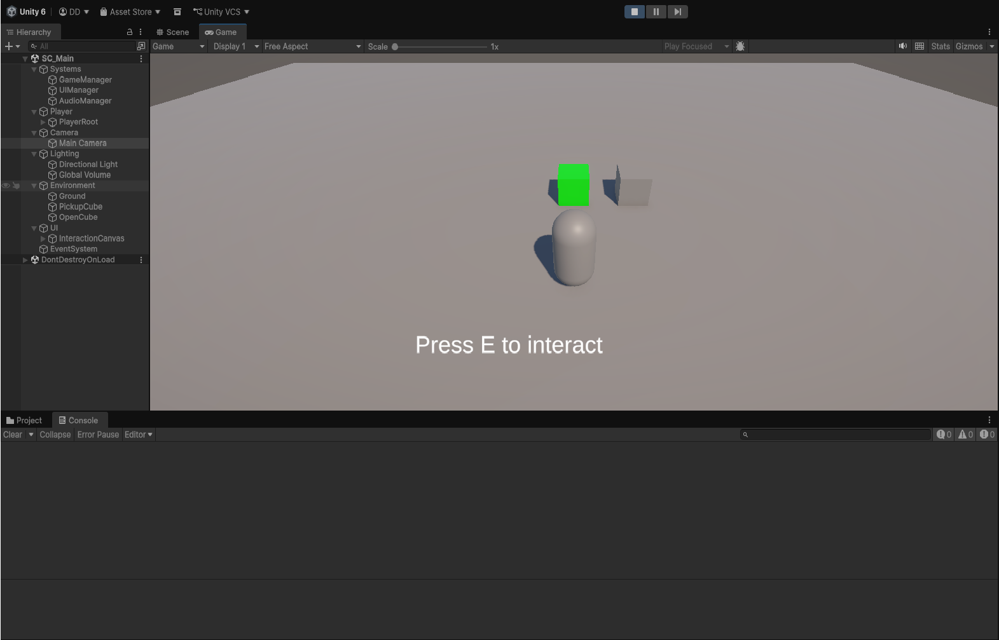
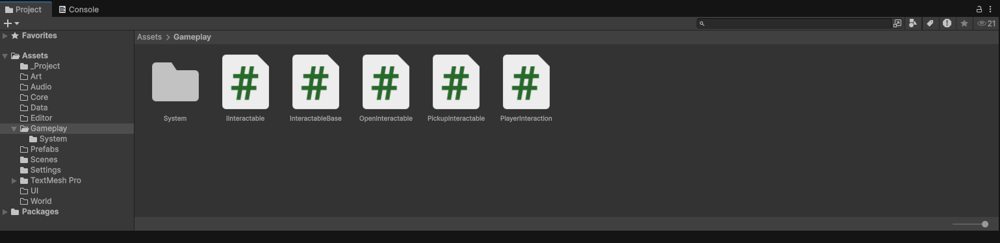

# Unity Player Interaction System

A clean and reusable interaction system built in Unity.

---

## 🎮 Features
- Player interaction with objects
- Pickup system
- Trigger-based interaction
- UI feedback (Press E / interaction hint)
- Modular and easy to expand

---

## 📸 Screenshots

### Before Interaction

### Interaction Prompt

### System Setup (Scripts)

---

## 🧠 System Overview
This system is designed to be simple but flexible.

You can easily:
- Add new interactable objects
- Extend interaction types (open, pickup, trigger)
- Integrate with inventory or quest systems

---

## 🎯 Use Cases
- Adventure games
- Survival systems
- Simulation games
- Prototype development

---

## 🚀 Demo
(Add your video link here)

---
